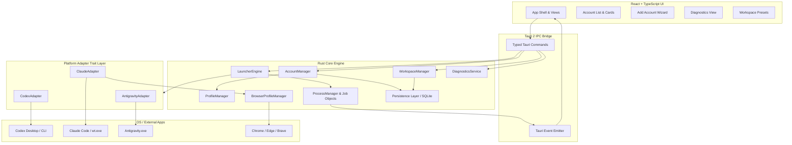

# AI Switcher — Architecture Specification (ARCHITECTURE.md)

**Version:** 1.0.0 (Phase 0 Baseline)  
**Target OS:** Windows 10 / Windows 11 (64-bit)  
**Stack:** Tauri 2 (Rust backend) + React 19 + TypeScript + SQLite  

---

## 1. Architectural Principles

1. **Adapter Pattern:** All platform-specific behaviors (executable detection, argument generation, environment injection, status probing, login orchestration) are encapsulated behind a unified `PlatformAdapter` trait. Zero platform conditional logic (`if platform == "codex"`) in core business or UI layers.
2. **Strict Security Isolation:** Secrets belong to original applications and OS keychains. No secret scraping, no credential rewriting, no password storage.
3. **Structured Process Spawning:** No string concatenation into shells. All processes are spawned via structured Windows APIs (`std::process::Command` / Windows Job Objects) with strictly separated arguments.
4. **Resilient Persistence:** ACID-compliant local storage using SQLite via `rusqlite` with schema versioning and forward-only migrations.
5. **Separation of Concerns:** Unidirectional data flow. Rust backend owns OS interactions, process lifecycle, filesystem safety, and database persistence; React frontend owns presentation, user interaction, and accessible state visualization.

---

## 2. High-Level Architecture Diagram



---

## 3. Rust Backend Modular Breakdown

### 3.1 `PlatformAdapter` Trait (`src-tauri/src/adapters/mod.rs`)

Every AI platform implements this common trait:

```rust
use async_trait::async_trait;
use std::path::{Path, PathBuf};
use crate::models::{AccountProfile, AccountStatus, LaunchTarget};
use crate::error::Result;

#[derive(Debug, Clone)]
pub struct LaunchSpec {
    pub executable: PathBuf,
    pub arguments: Vec<String>,
    pub environment: Vec<(String, String)>,
    pub working_directory: PathBuf,
    pub is_terminal: bool,
}

#[async_trait]
pub trait PlatformAdapter: Send + Sync {
    /// Identifier for this platform ('codex', 'claude', 'antigravity')
    fn platform_id(&self) -> &'static str;

    /// Human-readable name of the platform
    fn display_name(&self) -> &'static str;

    /// Locate default executable on host system
    fn detect_executable(&self) -> Result<PathBuf>;

    /// Initialize directory structure and seed configuration files for a new profile
    fn initialize_profile(&self, profile_path: &Path) -> Result<()>;

    /// Probe real-time authentication status without disrupting active sessions
    async fn check_status(&self, profile: &AccountProfile) -> Result<AccountStatus>;

    /// Build the launch specification for opening an account (GUI or Terminal)
    fn build_launch_spec(
        &self, 
        profile: &AccountProfile, 
        target: LaunchTarget, 
        workspace_path: Option<&Path>
    ) -> Result<LaunchSpec>;

    /// Start official authentication flow (browser launch or interactive CLI)
    async fn start_login_flow(
        &self, 
        profile: &AccountProfile, 
        browser_manager: &crate::browser::BrowserProfileManager
    ) -> Result<()>;

    /// Execute clean logout by clearing profile session state
    async fn logout(&self, profile: &AccountProfile) -> Result<()>;
}
```

---

### 3.2 Platform Implementations

#### `CodexAdapter`
- **Detection:** Checks PATH for `codex.exe`, inspects `%LOCALAPPDATA%\OpenAI\Codex\bin\*\codex.exe` and `%LOCALAPPDATA%\Programs\OpenAI\Codex\bin\codex.exe`. Detects `OpenAI.Codex` MSIX package.
- **Initialization:** Creates profile folder, sets up default `config.toml` structure, `log/`, and `tmp/`.
- **Status Check:** Runs `codex.exe login status` with `CODEX_HOME=<profile_path>`. Parses exit code (0 -> `Ready`, 1 -> `LoginRequired`). Probes isolated CLI backend credentials.
- **Launch Spec:**
  - Desktop target: calls `codex.exe app <workspace_path>` to open workspace in native Codex Desktop GUI.
  - CLI target: spawns external terminal running `codex.exe` with `CODEX_HOME=<profile_path>` for isolated CLI sessions.
- **Logout:** Executes `codex.exe logout` with `CODEX_HOME` and cleans up profile credentials.
- **Verified Boundaries & Known Limitations:**
  - CLI profile isolation is **verified** via `CODEX_HOME`.
  - Desktop workspace launch is **verified** via `codex app [PATH]`.
  - Desktop account-profile isolation is **unsupported/unverified** because Windows MSIX protocol activation routes through `RuntimeBroker` without propagating ephemeral in-memory environment variables.
  - Codex Desktop concurrent instances are **unsupported** (`InstancePolicy::SingleInstance` enforced).
  - AI Switcher maintains a strict separation: **Codex CLI Account Profile** vs **Codex Desktop Session**, and does not use unsupported token swapping or MSIX modifications.

#### `ClaudeAdapter` (Desktop-First)
- **Primary Execution Surface:** `ExecutionSurface::DesktopApp` launches the native Claude Desktop GUI application (`AnthropicClaude\claude.exe`) directly into Claude Code.
- **Detection:**
  - Desktop executable: `%LOCALAPPDATA%\AnthropicClaude\claude.exe` and versioned directory `%LOCALAPPDATA%\AnthropicClaude\app-*\claude.exe`.
  - CLI executable: `%USERPROFILE%\.local\bin\claude.exe` and system PATH.
- **Profile Initialization & Scaffolding:**
  - Creates `<profile_path>\desktop` for isolated Electron/Chromium `userData`.
  - Creates `<profile_path>\cli\projects` for isolated CLI workspace sessions.
  - Creates `<profile_path>\projects` for backward compatibility.
- **Desktop Launch Specification & Deep Link Routing:**
  - Arguments: `--user-data-dir="<profile_path>\desktop"` and deep link `"claude://code/new?folder=<percent_encoded_workspace>"`.
  - Working directory: configured workspace path.
  - Encoding: robust URL percent-encoding preserving alphanumeric, `-`, `_`, `.`, `~`, `/`, and `:`, percent-encoding spaces (`%20`) and Korean/Unicode characters.
- **Session & Profile Isolation Guarantees:**
  - Live testing proved Electron runtime honors `--user-data-dir="<path>"`.
  - Dedicated cookies, LocalStorage, IndexedDB, SafeStorage encryption key, and `config.json` are maintained exclusively within `<profile_path>\desktop`, leaving `%APPDATA%\Claude` untouched.
  - Electron single-instance lock is scoped per `userData` directory. Multiple Claude Desktop instances with different profiles run concurrently as independent process trees (`InstancePolicy::MultiInstance`).
- **Secondary / Fallback Surfaces:**
  - `ExecutionSurface::Cli`: spawns `wt.exe -d <workspace_path> claude.exe` with `CLAUDE_CONFIG_DIR=<profile_path>\cli`.
  - `ExecutionSurface::Web`: launches isolated Chromium browser via `BrowserProfileManager` navigating to `https://claude.ai`.
- **Status Probing:**
  - Probes auth status via `claude auth status --json` with `CLAUDE_CONFIG_DIR=<profile_path>\cli`. Parses returned `{"loggedIn": bool}` (`ready` vs `login_required`).
- **Logout:** Executes `claude auth logout` with `CLAUDE_CONFIG_DIR` and cleans up isolated CLI/Desktop credential caches.

#### `AntigravityAdapter` (Desktop-First)
- **Primary Execution Surface:** `ExecutionSurface::DesktopApp` launches the native Antigravity Desktop application (`Antigravity.exe`).
- **Detection:** Checks `%LOCALAPPDATA%\Programs\antigravity\Antigravity.exe`, `%ProgramFiles%\Google\Antigravity\Antigravity.exe`, `%ProgramFiles%\antigravity\Antigravity.exe`, and PATH (`where.exe`).
- **Profile Initialization & Scaffolding:**
  - Creates `<profile_path>\home\.gemini` for isolated Google/Gemini state (`antigravity/`, `config/`, `oauth_creds.json`).
  - Creates `<profile_path>\data` for isolated Electron/Chromium `userData` (LocalStorage, IndexedDB, cookies, `app_storage.json`).
  - Creates `<profile_path>\appdata` for GPU and application cache.
- **Desktop Launch Specification:**
  - Executable: `Antigravity.exe`
  - Arguments: `--user-data-dir="<profile_path>\data"` (plus optional profile launch arguments).
  - Injected Environment:
    - `USERPROFILE = <profile_path>\home`
    - `HOME = <profile_path>\home`
    - `APPDATA = <profile_path>\appdata`
  - Working directory: workspace path (or profile directory).
- **Session & Profile Isolation Guarantees (Verified Live):**
  - Live host testing confirmed `--user-data-dir` completely isolates Chromium storage in `<profile>\data`.
  - Live host testing confirmed overriding `USERPROFILE` directs both Node.js runtime and Go `language_server.exe` to isolate `.gemini` state inside `<profile>\home\.gemini`, leaving the user's real `%USERPROFILE%\.gemini` and `%APPDATA%\Antigravity` 100% untouched.
- **Concurrency & Multi-Instance Support (Verified Live):**
  - Live tested concurrent execution: Profile A (PID 23220) and Profile B (PID 28164) ran simultaneously as separate process trees with independent directories while the host instance also ran (`InstancePolicy::MultiInstance`).
- **Workspace Launch Limitation (Verified):**
  - Antigravity's Electron `main.js` only parses `antigravity://` deep links and Chromium flags; bare positional folder arguments are ignored.
  - Workspace opening is initiated inside the GUI via project history or `dialog:open-workspace`. AI Switcher sets process working directory (`cwd`) to the target workspace.
- **Managed Directory Safety:**
  - Implements `validate_profile_id`, `validate_antigravity_profile_dir`, and `safe_delete_antigravity_profile_dir`.
  - Rejects traversal (`..`), path separators, user home, system `.gemini`, and system `AppData\Roaming\Antigravity`.
- **Status Probing:**
  - Safely checks existence and non-zero size of `<profile_path>\home\.gemini\oauth_creds.json` without inspecting or copying tokens (`ready` vs `login_required`).
- **Logout:**
  - Clears `<profile_path>\home\.gemini\oauth_creds.json` and session cookies from `<profile_path>\data\Network\Cookies`.

---

### 3.3 `LauncherEngine` & `ProcessManager` (`src-tauri/src/launcher/`)

The execution engine is organized around **Execution Surfaces** rather than assuming a single launch modality:

1. **`ExecutionSurface` Model:**
   - `DesktopApp`: Native Windows GUI processes spawned detached (`DesktopAppLauncher`). Default for Codex Desktop and Antigravity.
   - `Cli`: Spawned in external terminal (`CliLauncher`) preferring Windows Terminal (`wt.exe`) with PowerShell (`powershell.exe`) fallback. Default for Claude Code.
   - `Web`: Web URL opened via Chromium browser or system default (`WebLauncher`).

2. **Structured Process Spawning:**
   - All processes are spawned via structured `std::process::Command` calls.
   - Individual arguments, environment variables (`CODEX_HOME`, `CLAUDE_CONFIG_DIR`, etc.), and working directories are mapped without shell string concatenation.
   - Paths containing spaces and Unicode/Korean characters are fully supported and verified via automated tests.

3. **`ProcessManager` & Concurrency Invariants:**
   - **Cross-Platform Independence:** Codex running never conflicts with Claude or Antigravity. Zero cross-platform interference.
   - **Same-Platform Conflict Detection:**
     - `InstancePolicy::MultiInstance`: Multiple profiles of the same platform may run simultaneously (e.g. Claude Code CLI).
     - `InstancePolicy::SingleInstance`: Only one active profile is permitted (e.g. Codex Desktop). Attempting to open profile B while profile A is active triggers `check_platform_conflict` returning `ProcessConflictInfo`.
   - **Critical Process Safety Rule:** AI Switcher **never** automatically force-kills an application. The user is prompted with an explicit confirmation dialog:
     *"Another [Platform] profile is currently running. Close [Account A] and switch to [Account B]? [Cancel] [Close and Switch]"*.
   - **Process Lifecycle Tracking:** Tracks `launch_id`, `account_id`, `platform`, `surface`, `pid`, `executable`, `launch_timestamp`, and `is_running` via live OS process table polling.


---

### 3.4 `BrowserProfileManager` (`src-tauri/src/browser/`)

The Browser Profile Engine provides persistent, isolated Chromium browser environments for official authentication flows (OAuth, Google SSO, passkeys) and web AI targets (Claude Web):

1. **Discovery (`discovery.rs`):**
   - Automatically detects Google Chrome, Microsoft Edge, and Brave Browser across standard 64-bit/32-bit Program Files, LocalAppData, and PATH (`where.exe`).
   - Extracts exact Chromium engine version from adjacent version directories (e.g. `152.0.7977.76`).
   - Supports user-configured custom Chromium executable overrides with pre-launch validation.

2. **Directory Safety & Isolation (`safety.rs`):**
   - Persistent directory: `%APPDATA%\AI-Switcher\browser-profiles\<profile_id>\`.
   - Strict ID validation (`validate_profile_id`): rejects relative navigation (`..`), slashes, path separators, or null bytes.
   - Path containment (`validate_browser_profile_dir`): ensures resolved path is strictly a direct child of the base directory.
   - Protection of personal user data: explicitly rejects any attempt to target default browser directories such as `%LOCALAPPDATA%\Google\Chrome\User Data`.
   - Reference-safe deletion: queries SQLite to ensure no active account profiles reference a browser profile before allowing deletion.

3. **Command Construction & Security (`launcher.rs`):**
   - Structured command execution:
     ```cmd
     <browser_path> --user-data-dir="<path>" --no-first-run --no-default-browser-check <url>
     ```
   - Injection prevention: rejects target URLs beginning with `-` or `/`.
   - URL Redaction filter (`redact_url_for_diagnostics`): strips sensitive query parameters (`code`, `token`, `access_token`, `state`, etc.) before logging or diagnostics display.

4. **Integration with Generic Launcher:**
   - When an account is launched with `ExecutionSurface::Web` (e.g., Claude Web), the launcher automatically routes to the account's linked `BrowserProfile`.

---

## 4. Persistence & Database Schema (`src-tauri/src/db/`)

Persistence is handled locally using embedded SQLite via `rusqlite` with WAL mode enabled.

### SQLite Schema (`v1` + `v2` migrations):

```sql
CREATE TABLE IF NOT EXISTS accounts (
    id TEXT PRIMARY KEY NOT NULL,
    platform TEXT NOT NULL,
    display_name TEXT NOT NULL,
    account_identifier TEXT,
    login_method TEXT NOT NULL,
    status TEXT NOT NULL,
    profile_path TEXT NOT NULL,
    browser_profile_path TEXT,
    browser_profile_id TEXT REFERENCES browser_profiles(id) ON DELETE SET NULL,
    custom_executable_path TEXT,
    launch_arguments TEXT NOT NULL,       -- JSON array of strings
    environment_variables TEXT NOT NULL,  -- JSON object string
    default_workspace_path TEXT,
    is_enabled INTEGER NOT NULL DEFAULT 1,
    last_launched_at TEXT,
    created_at TEXT NOT NULL,
    updated_at TEXT NOT NULL
);

CREATE TABLE IF NOT EXISTS browser_profiles (
    id TEXT PRIMARY KEY NOT NULL,
    display_name TEXT NOT NULL,
    browser_kind TEXT NOT NULL,
    custom_executable_path TEXT,
    user_data_directory TEXT NOT NULL,
    created_at TEXT NOT NULL,
    updated_at TEXT NOT NULL,
    last_used_at TEXT
);

CREATE TABLE IF NOT EXISTS workspaces (
    id TEXT PRIMARY KEY NOT NULL,
    name TEXT NOT NULL,
    directory_path TEXT NOT NULL UNIQUE,
    preferred_codex_account_id TEXT REFERENCES accounts(id) ON DELETE SET NULL,
    preferred_claude_account_id TEXT REFERENCES accounts(id) ON DELETE SET NULL,
    preferred_antigravity_account_id TEXT REFERENCES accounts(id) ON DELETE SET NULL,
    last_opened_at TEXT,
    created_at TEXT NOT NULL,
    updated_at TEXT NOT NULL
);

CREATE TABLE IF NOT EXISTS app_settings (
    key TEXT PRIMARY KEY NOT NULL,
    value TEXT NOT NULL
);

CREATE INDEX IF NOT EXISTS idx_accounts_platform ON accounts(platform);
CREATE INDEX IF NOT EXISTS idx_accounts_status ON accounts(status);
```

---

## 5. Security Architecture & Threat Modeling

| Threat Vector | Mitigation Strategy |
| :--- | :--- |
| **Credential Scraping** | AI Switcher stores zero credentials. Only filesystem paths, display names, and launch args exist in SQLite. |
| **Command Argument Injection** | Arguments are passed as distinct array elements directly to Windows `CreateProcess` via Rust `std::process::Command`. Never passed through `cmd.exe /c` or raw shell string concatenation. |
| **Path Traversal Attacks** | All user-supplied and generated paths are normalized via `std::fs::canonicalize` and verified to reside within designated sandbox or allowed drive boundaries. |
| **Session Bleed / Crossover** | Every profile receives a dedicated folder structure. Browser profiles use distinct `--user-data-dir`. Environment variables (`CODEX_HOME`, `CLAUDE_CONFIG_DIR`, `USERPROFILE`) are strictly scoped per spawned process child environment. |
| **Token Leakage in Logs** | Redaction filter applied to all stdout/stderr diagnostic capturing. Any string matching OAuth patterns, Bearer tokens, or API keys is censored as `[REDACTED]`. |

---

## 6. Typed Error Hierarchy (`src-tauri/src/error.rs`)

All backend functions return `Result<T, AppError>` serialized to JSON for Tauri IPC:

```rust
use serde::Serialize;
use thiserror::Error;

#[derive(Debug, Error, Serialize)]
#[serde(tag = "type", content = "details")]
pub enum AppError {
    #[error("Executable not found for platform: {0}")]
    ExecutableNotFound(String),

    #[error("Profile directory is invalid or inaccessible: {0}")]
    InvalidProfilePath(String),

    #[error("Process conflict: profile '{running_profile}' is currently running (PID {pid})")]
    ProcessConflict { running_profile: String, pid: u32 },

    #[error("Platform authentication error: {0}")]
    AuthError(String),

    #[error("Launch failed: {0}")]
    LaunchFailed(String),

    #[error("Database error: {0}")]
    DatabaseError(String),

    #[error("IO error: {0}")]
    IoError(String),

    #[error("Operation cancelled by user")]
    Cancelled,
}
```

---

## 7. Frontend Presentation & State Management

- **Framework:** React 19 + TypeScript + Vite.
- **Styling:** Compact developer styling with custom CSS variables for dark/light themes.
- **State Management:** Lightweight React state synchronizing profile state via Tauri IPC and typed API wrappers.
- **Accessible UI Standards:** Color alone is never used to convey status. Every status badge displays accessible iconography with explicit descriptive text.

---

## 8. Phase 7 — Account Registration Wizard & Lifecycle UX Architecture

### 8.1 Backend Capability Reporting (`PlatformCapabilities`)
To eliminate frontend hallucinations and guarantee that the UI truthfully presents platform capabilities, the backend exposes `list_platform_capabilities()` returning:
```rust
pub struct PlatformCapabilities {
    pub platform: PlatformType,
    pub display_name: String,
    pub description: String,
    pub primary_surface: ExecutionSurface,
    pub supported_surfaces: Vec<ExecutionSurface>,
    pub supports_desktop_isolation: bool,
    pub isolation_summary: String,
    pub instance_policy: InstancePolicy,
    pub supports_automated_status_probe: bool,
    pub supports_logout: bool,
    pub requires_browser_profile: bool,
    pub recommended_browser_profile: bool,
}
```
Crucially, OpenAI Codex explicitly reports `supports_desktop_isolation: false` and notes that Codex Desktop is single-instance sharing the global Windows session, with profile isolation supported on CLI only via `CODEX_HOME`.

### 8.2 7-Step Registration Wizard Backend Flow
1. **Platform Selection:** Fetches capabilities; renders surface badges and truthful capability warnings.
2. **Metadata:** Collects display name (validated), account identifier (hint), login method metadata, and optional default workspace path with native folder browsing.
3. **Browser Association:** Configures dedicated browser profile, shared browser profile (with warning), or system default browser.
4. **Scaffolding:** Creates isolated profile directories and persists account record in `LoginRequired` status.
5. **Official Authentication:** Triggers `start_login_flow` to launch the platform's official sign-in flow.
6. **Non-Intrusive Verification:** Probes authentication status without inspecting tokens (`codex login status`, Claude credential store, Antigravity `oauth_creds.json`).
7. **Ready:** Displays completion card and enables immediate launch.

### 8.3 Official Authentication Launcher (`start_login_flow`)
Launches official login through the platform's verified primary execution surface:
- **Codex:** Spawns external terminal executing `codex login` with `CODEX_HOME` injected.
- **Claude:** Spawns Claude Desktop with `--user-data-dir="<profile>\desktop"`.
- **Antigravity:** Spawns Antigravity Desktop with `--user-data-dir="<profile>\data"` and `USERPROFILE="<profile>\home"`.

### 8.4 Draft Account Cancellation & Rollback (`cleanup_draft_account`)
If the user cancels after Step 4, they are presented with:
- **Keep Profile for Later:** Preserves the account in `LoginRequired` state.
- **Delete Local Setup & Discard:** Atomically deletes the newly scaffolded directory (guaranteed inside managed profile roots) and purges the SQLite database row.

### 8.5 Account Lifecycle UX
- **Rename:** Updates display name and identifier without altering filesystem paths.
- **Disable / Re-enable:** Toggles `is_enabled` flag in SQLite. Launcher engine rejects launch of disabled profiles with `AppError::AccountDisabled` while preserving all local login files.
- **Re-login:** Available from card button or menu for accounts in `LoginRequired` state, reusing the existing directory.
- **Logout:** Purges cached session tokens in the profile and sets status to `LoginRequired` without deleting the profile.
- **Two-Tier Deletion:**
  - *Tier 1 (Database only):* Removes record from SQLite, leaving profile directory intact.
  - *Tier 2 (Database + Filesystem):* Removes record and recursively deletes profile directory within canonical profile root bounds.
- **Shared Browser Profile Reference Safety:** Deletion checks `count_accounts_referencing_browser_profile`. If multiple accounts share a browser profile, deleting one account retains the browser profile and warns the user.

---

## 9. Phase 8 — Workspace Presets & Multi-Agent Mapping Architecture

### 9.1 Database Schema & Foreign Key Constraints
The `workspaces` table stores project directory presets with optional preferred account bindings:
```sql
CREATE TABLE IF NOT EXISTS workspaces (
    id TEXT PRIMARY KEY NOT NULL,
    name TEXT NOT NULL,
    directory_path TEXT NOT NULL,
    preferred_codex_account_id TEXT REFERENCES accounts(id) ON DELETE SET NULL,
    preferred_claude_account_id TEXT REFERENCES accounts(id) ON DELETE SET NULL,
    preferred_antigravity_account_id TEXT REFERENCES accounts(id) ON DELETE SET NULL,
    last_opened_at TEXT,
    created_at TEXT NOT NULL,
    updated_at TEXT NOT NULL
);
```

### 9.2 `ON DELETE SET NULL` Behavior
When an account profile is deleted, SQLite's foreign key engine automatically resets the corresponding `preferred_*_account_id` in `workspaces` to `NULL`. Workspace presets are never deleted or corrupted by account removal.

### 9.3 Workspace Account Resolution Algorithm
When launching a workspace preset on a given platform:
1. If a preferred account is configured:
   - If that account exists and is enabled, use it.
   - If that account exists but is disabled, abort with `AppError::AccountDisabled`.
2. If no preferred account is configured (or if the preferred account was deleted):
   - Fall back to the first enabled account of that platform in SQLite.
   - If no enabled accounts exist for that platform, abort with `AppError::NotFound`.

### 9.4 Platform-Specific Workspace Launching
- **OpenAI Codex:** Injects `workspace_path` as `codex app <workspace_path>` for Desktop app launch, or sets working directory for CLI launch.
- **Anthropic Claude:** Generates deep link `claude://open?workspace=<path>` to open Claude Desktop directly into Claude Code on that project.
- **Google Antigravity (CWD-Only Limitation):**
  - **CRITICAL ARCHITECTURAL INVARIANT:** Antigravity Desktop does **NOT** accept a bare positional CLI argument for workspaces (e.g., `Antigravity.exe C:\path`).
  - Therefore, `AntigravityAdapter::build_launch_spec` sets `working_directory = workspace_path` and **never** appends `workspace_path` to CLI arguments. Workspace selection inside Antigravity is handled via native GUI menus or recent workspaces.

### 9.5 Missing Workspace Directory Policy
AI Switcher strictly avoids silent auto-creation of missing project directories.
When `launch_workspace_preset` encounters a directory that does not exist on disk:
1. Returns `AppError::WorkspaceDirectoryNotFound(path)`.
2. UI displays an explicit dialog: **Workspace Folder Not Found**.
3. User must select:
   - **[Locate Folder]:** Opens native Windows folder picker via `tauri-plugin-dialog`, updates the workspace preset directory path, and launches.
   - **[Create Folder]:** Explicitly invokes `create_workspace_directory` command and launches.
   - **[Cancel]:** Dismisses dialog without modifying disk state.

### 9.6 Native Windows Folder Picker Integration
Folder selection across both the Registration Wizard (Step 2) and Workspace Presets utilizes official Tauri 2 dialog plugin (`tauri-plugin-dialog` / `@tauri-apps/plugin-dialog`):
- Restricts selection strictly to directories (`directory: true`, `multiple: false`).
- Supports spaces, Korean Hangul characters, Unicode, and long Windows paths.
- Preserves manual text input alongside the browse button.

---

## 10. Phase 9 — Windows Integration & Everyday Utility Architecture

Phase 9 turns AI Switcher into an everyday Windows desktop utility that lives unobtrusively in the Windows system tray and enables instant profile switching via native tray menus and global hotkeys.

### 10.1 Native System Tray Subsystem (`src-tauri/src/tray/mod.rs`)

The system tray engine is implemented directly with Tauri 2's native Tray and Menu APIs:
- **Modular Menu Builder (`build_tray_menu`):** Pure function generating a native `Menu` from the current SQLite state, enabling headless unit testing without requiring an active GUI window.
- **Dynamic Hierarchy:**
  1. **Favorites Submenu:** Starred accounts and workspace presets with their bound platforms.
  2. **Recent Launches Submenu:** Merged chronological history of the last 5 launched accounts and opened workspaces.
  3. **Platform Submenus (Codex, Claude, Antigravity):** Direct access to all enabled account profiles for each platform.
  4. **Workspaces Submenu:** All saved workspaces with quick-launch targets for Codex, Claude, and Antigravity.
  5. **Window & Lifecycle Items:** "Open AI Switcher", "Settings...", and "Quit AI Switcher".
- **Tray Interactions:**
  - **Left-Click:** Unminimizes, shows, and focuses the main application window.
  - **Right-Click:** Opens the native Windows context menu.
- **Dynamic Tray Refresh:** Invoked automatically (`refresh_tray_menu`) whenever accounts, favorites, or workspaces are modified from the frontend or backend.

### 10.2 Close-to-Tray & One-Time Notice Invariants

- **`CloseRequested` Event Interception:** Intercepts `WindowEvent::CloseRequested` in `src-tauri/src/lib.rs`.
- **Configurable Behavior:** If `close_to_tray` is enabled in `AppSettings` (default: `true`), the close event is cancelled via `api.prevent_close()` and the window is hidden (`window.hide()`).
- **First-Close Educational Dialog (`FirstCloseDialog.tsx`):** On the very first close action, a native dialog explains that AI Switcher is still active in the tray with a "Don't show this message again" checkbox.
- **Clean Application Termination:** Selecting "Quit AI Switcher" from the tray menu executes `app.exit(0)`, terminating all background workers and releasing SQLite locks cleanly.

### 10.3 Single-Instance Enforcement (`tauri-plugin-single-instance`)

- Running a second instance of `ai-switcher.exe` (e.g. from the Start Menu or command line) is intercepted by the Windows single-instance mutex.
- The existing instance retrieves the `main` webview window, unminimizes it, makes it visible, and sets foreground window focus.
- Avoids multiple conflicting SQLite WAL locks and duplicate tray icons.

### 10.4 Windows Autostart & Start Minimized (`tauri-plugin-autostart`)

- Registers AI Switcher in Windows startup registry (`HKCU\Software\Microsoft\Windows\CurrentVersion\Run`).
- Supports the `--minimized` argument when launched on startup, keeping the window hidden in the tray until invoked.

### 10.5 Global Keyboard Shortcuts (`tauri-plugin-global-shortcut`)

- Configurable global window toggle shortcut (default: `CommandOrControl+Alt+S`).
- Handled with conflict testing: if another application owns the hotkey combination, AI Switcher displays an informative error without crashing.

### 10.6 Unified Launch Pipeline Invariant

**CRITICAL INVARIANT:** All launch entry points—GUI action buttons, System Tray menu items, and global keyboard shortcuts—route through the identical backend functions:
- `launch_profile_impl(account_id, surface, workspace_path, &state)`
- `launch_workspace_preset_impl(workspace_id, platform, surface, &state)`

This guarantees that:
- Antigravity CWD-only workspace behavior is strictly preserved regardless of where the launch was triggered.
- Codex Desktop single-instance limitations are enforced identically.
- Process tracking, conflict detection, and `last_launched_at` / `last_opened_at` timestamps are updated consistently across all execution surfaces.

### 10.7 Theme System & SQLite Settings

- **`app_settings` Table:** Key-value store persisting `theme` ("system" | "light" | "dark"), `close_to_tray`, `start_minimized`, `first_close_shown`, and `global_shortcut`.
- **Theme Provider:** CSS custom property system responding to `.theme-light`, `[data-theme="light"]`, `.theme-dark`, `[data-theme="dark"]`, and Windows `prefers-color-scheme`.

---

## 11. Phase 10 — Security, Recovery & Reliability Architecture

Phase 10 hardens AI Switcher into an enterprise-grade, resilient utility capable of self-healing, safe profile recovery, zero data loss, safe filesystem interactions, and leak-free diagnostics.

### 11.1 Resilient Persistence & Schema Migrations (`src-tauri/src/db/mod.rs`)

1. **Transactional Migrations via `PRAGMA user_version`:**
   - Schema version is tracked via SQLite's atomic `user_version` pragma (currently v4).
   - Migrations are sequential, forward-only, and wrapped in database transactions:
     - **v1:** Base accounts, launch targets, execution logs.
     - **v2:** Browser profiles, browser bindings, shared reference counters.
     - **v3:** Workspace presets and directory bindings.
     - **v4:** App settings, favorites table, foreign key cascades, and system metadata.
   - Backward-compatibility detection inspects table structures if `user_version == 0` on existing legacy databases, upgrading cleanly to v4.
2. **Automated SQLite Backups (`VACUUM INTO`):**
   - Before executing schema migrations or upon explicit user request, a live snapshot of the database is created via `VACUUM INTO '<backup_path>'`.
   - Backups are stored in `%APPDATA%\AI-Switcher\backups\ai_switcher_backup_<timestamp>.db`.
   - **Retention Policy:** Automated cleanup retains the most recent 5 backup snapshots, pruning older files to prevent disk bloating.
3. **Database Integrity Verification:**
   - `PRAGMA integrity_check(1)` runs during startup and diagnostics.
   - Any corruption is isolated and reported as `AppError::DatabaseCorrupt` with recovery instructions.

### 11.2 Filesystem Safety & Windows Reparse Point Protection (`src-tauri/src/fs_safety.rs`)

1. **Canonical Containment Validation (`validate_safe_containment`):**
   - Every deletion or write operation validates that the target path resolves strictly inside the application's managed root (`%APPDATA%\AI-Switcher` or configured profile root).
   - Prevents traversal attacks (`..`, symlinks, junction breakouts) from escaping into critical Windows directories (`C:\`, `C:\Windows`, `C:\Users\<user>`).
2. **Windows Junction & Symlink Safe Deletion (`safe_remove_dir_all`):**
   - **CRITICAL SAFETY INVARIANT:** A profile directory containing a Windows directory junction or symlink pointing to an external user folder (e.g. `C:\Users\<user>\Documents`) must NEVER delete the contents of the target folder.
   - Inspects Win32 directory metadata (`FILE_ATTRIBUTE_REPARSE_POINT = 0x400`, `FILE_ATTRIBUTE_DIRECTORY = 0x10`).
   - If a directory entry is a reparse point / junction, AI Switcher unlinks the junction itself using Windows `remove_dir` / `remove_file` without recursing into target files.
   - Normal directories are traversed depth-first with read-only permission stripping (`set_readonly(false)`).

### 11.3 Profile Health & Non-Destructive Repair Model

1. **Typed Profile Health (`ProfileHealth` enum):**
   - `Healthy`: Directory exists, valid structure, credentials intact, profile lock-free.
   - `MissingDirectory`: Profile root folder deleted or moved by user.
   - `CorruptedScaffolding`: Required subdirectories (`home`, `data`, `logs`) missing.
   - `SessionExpired`: Credentials expired or missing; adapter reports `AccountStatus::LoginRequired`.
   - `Locked`: Profile locked by an active process or orphaned lockfile (`SingletonLock`).
2. **Non-Destructive Repair Invariant:**
   - Account repair (`repair_account_profile`) recreates missing directory scaffolding without touching existing config files.
   - Never fabricates mock credentials; if authentication files were deleted, status is set to `LoginRequired` so the user can re-authenticate cleanly.

### 11.4 Process Safety & PID Reuse Protection (`src-tauri/src/launcher/process_manager.rs`)

- **Windows PID Recycled Detection:** Windows recycles PIDs rapidly. To prevent AI Switcher from mistaking an unrelated new process for an active AI IDE:
  - When recording a spawned process with an absolute executable path, `ProcessManager` verifies that the active PID's executable name matches the original binary name (`expected_file_name`).
  - If a mismatch or non-existent process is found, the PID is culled from active tracking.

### 11.5 Sanitized Support Bundle Export

- Accessible via Diagnostics & Repair Center.
- Produces a single JSON diagnostic bundle containing OS environment, schema version, integrity status, backup history, and sanitized account statuses.
- **Zero-Secret Guarantee:** Redacts all authorization headers, bearer tokens, API keys, session tokens, and passwords from URLs and configuration blocks.


