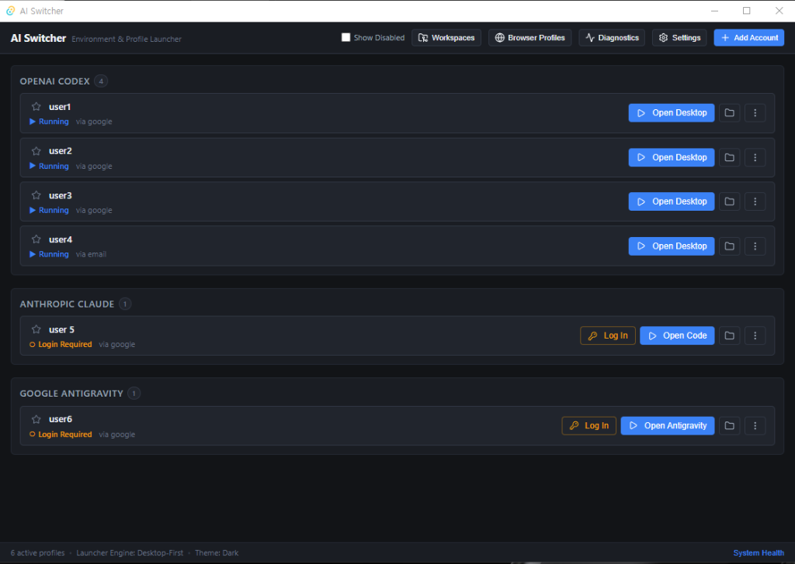
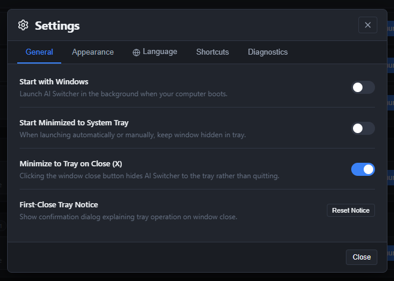
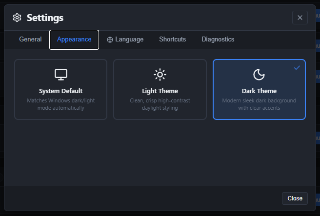
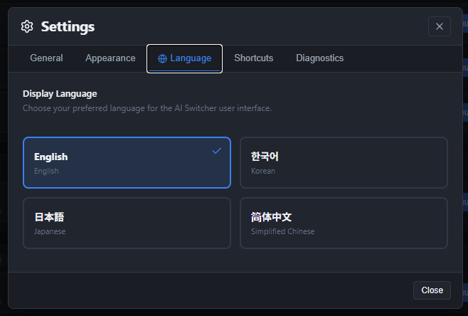
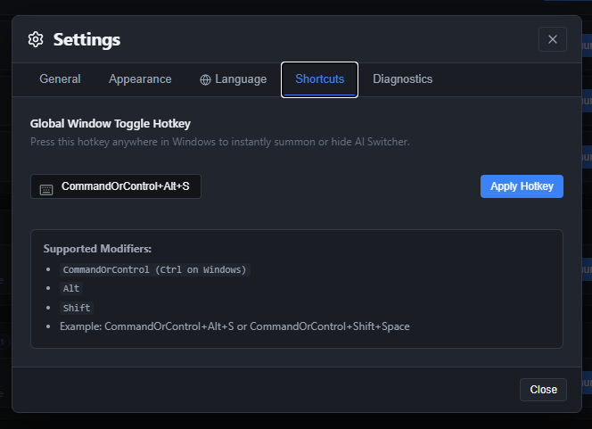

# AI Switcher (日本語)

<p align="center">
  <strong>OpenAI Codex、Anthropic Claude、Google Antigravity 対応の Windows マルチアカウント＆ワークスペース管理ツール</strong>
</p>

<p align="center">
  <a href="README.md"><strong>English</strong></a> |
  <a href="README.ko.md"><strong>한국어</strong></a> |
  <a href="README.ja.md"><strong>日本語</strong></a> |
  <a href="README.zh.md"><strong>简体中文</strong></a>
</p>

<p align="center">
  
  
  
  
  
</p>

---

## 📖 概要

**AI Switcher** は、複数の組織、クライアント、個人のアカウントを行き来して AI コーディングを行う開発者のための Windows デスクトップユーティリティです。**OpenAI Codex**、**Anthropic Claude**、**Google Antigravity** に完全対応しています。

**デスクトップファースト (Desktop-First)** で設計されており、アカウント切り替え時のセッション競合や認証情報の上書き、手動でのディレクトリ変更の手間を解消。タスクトレイやショートカットキーから1クリックで安全に隔離された作業環境を呼び出せます。



---

## ✨ 主な機能

### 🖥️ デスクトップファーストの完全プロファイル分離
- **Google Antigravity Desktop:** 独立した Chromium および `.gemini` ユーザーディレクトリを用意し、`--user-data-dir`、`USERPROFILE`、`APPDATA` を完全に分離。作業ディレクトリ (CWD) 検証による複数インスタンスの安全な同時起動をサポートします。
- **Anthropic Claude Desktop:** 分離された `--user-data-dir` プロファイルにより、ネイティブの Claude Desktop を **Claude Code** (`claude://code/new?folder=...`) セッションとして直接起動。複数プロファイルの同時起動が可能です。
- **OpenAI Codex Desktop & CLI:** Windows 上での単一インスタンスデスクトップセッションに加え、専用の `CODEX_HOME` 隔離ディレクトリを用いた独立した CLI ターミナル環境を完全サポートします。

### 📁 ワークスペースプリセット
- よく使用するプロジェクトフォルダとお気に入りのアカウント設定をプリセットとして保存し、1クリック（`Codex で開く`、`Claude で開く`、`Antigravity で開く`）で即座に起動できます。
- ディレクトリが見つからない場合でも、元ファイルを誤って削除することなくフォルダ再選択や新規作成を行える安全ダイアログを備えています。

### 🌐 多言語インターフェース
- **日本語**、**English**、**한국어**、**简体中文** の4言語を標準サポート。
- 設定画面で言語を選択するとアプリの再起動なしで即座にUI全体が切り替わり、SQLite に設定が保持されます。

---

## 🖼️ スクリーンショットと機能紹介

### 1. メインダッシュボード
プラットフォーム別に登録されたアカウント一覧、実行状態バッジ、お気に入り登録、ワンクリック起動ボタンを一元管理できます。


---

### 2. 一般設定＆タスクトレイ常駐
Windows 起動時の自動開始、起動時にトレイへ最小化、閉じる（`X`）ボタン押下時のトレイ最小化など、日常的な利用に最適な設定が可能です。



---

### 3. テーマ・外観設定
見やすい高コントラストなライトテーマ、目に優しいダークテーマ、Windows の外観設定に自動追従するシステムデフォルトをサポート。通知ボックスは WCAG AAA 基準（7:1以上）を満たしています。



---

### 4. 言語設定
**日本語**、**English**、**한국어**、**简体中文** から希望の言語を自由に選択できます。



---

### 5. グローバルショートカットキー
Windows 上のどのウィンドウを開いていても、設定したキー（既定: `CommandOrControl+Alt+S`）を押すだけで AI Switcher を瞬時に呼び出したりトレイへ格納できます。



---

## 🛡️ 安全性とセキュリティの保証

- **100% ローカル保存:** すべてのアカウントプロファイル、セッショントークン、設定はローカル PC 内の独立フォルダ（`%APPDATA%\AI-Switcher`）にのみ保存されます。
- **認証トークンの外部送信なし:** AI Switcher がユーザーのパスワード、API キー、OAuth トークンを外部サーバーへ送信したり傍受することはありません。
- **ジャンクション・シンボリックリンク保護:** アカウント削除時に Win32 Reparse Point メタデータを検査し、外部ドキュメントやプロジェクトの実ファイルが削除されないようリンクのみを安全に解除します。
- **自動 SQLite バックアップ:** `VACUUM INTO` によるスナップショット作成機能、直近5世代の自動バックアップ保持、起動時の完全性検査（`PRAGMA integrity_check`）を搭載しています。
- **匿名化サポートバンドル:** トラブルシューティング用の診断情報を書き出す際、パスワードやトークンを完全にマスキング処理します。

---

## 📦 インストール方法

コンパイル済みの Windows インストーラーは [Releases ページ](https://github.com/TaeyanG4/ai-switcher/releases/tag/v0.2.0) からダウンロードできます。

1. **`AI Switcher_0.2.0_x64-setup.exe`** をダウンロード。
2. インストーラーを実行（管理者権限不要で `%LOCALAPPDATA%\AI Switcher` に安全にインストールされます）。
3. スタートメニューまたはデスクトップから **AI Switcher** を起動。

---

## 🛠️ ソースコードからのビルド

### 必要要件
- Windows 10/11 64-bit
- [Node.js](https://nodejs.org/) (v18以降) & [pnpm](https://pnpm.io/)
- [Rust](https://www.rust-lang.org/) (MSVC ツールチェーン)

### 開発環境の起動
```powershell
# リポジトリのクローン
git clone https://github.com/TaeyanG4/ai-switcher.git
cd ai-switcher

# 依存パッケージのインストール
pnpm install

# バックエンドテストの実行 (88件のテスト通過を確認)
cargo test --manifest-path src-tauri/Cargo.toml

# 開発モードでアプリを起動
pnpm tauri dev
```

### 本番用インストーラーのビルド
```powershell
# フロントエンドのビルドとインストーラー生成
pnpm tauri build
```
生成されたファイルは `src-tauri/target/release/bundle/nsis/` に出力されます。

---

## 📄 ライセンス

MIT License. 詳細については [LICENSE](LICENSE) をご覧ください。
