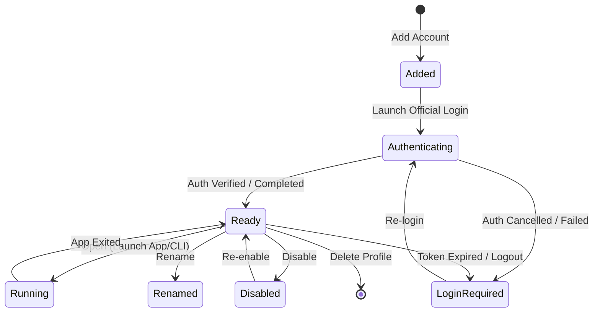

# AI Switcher — Product Specification (SPEC.md)

**Version:** 1.0.0 (Phase 0 Baseline)  
**Target OS:** Windows 10 / Windows 11 (64-bit)  
**Status:** Approved for Implementation  

---

## 1. Executive Summary & Problem Statement

Modern AI-assisted software development often requires managing multiple accounts across distinct platforms (OpenAI Codex, Anthropic Claude / Claude Code, and Google Antigravity). Developers frequently maintain separate personal, work, client, or experimental accounts. 

Currently, switching between these accounts requires:
- Manually signing out of the active account in web browsers and desktop applications.
- Re-authenticating via OAuth, entering one-time passwords (OTP), and completing multi-factor authentication (MFA).
- Losing existing local session state and disrupting ongoing workspace configurations.

**AI Switcher** is an open, local Windows desktop application that manages isolated account profiles and workspace presets. It acts as an **environment launcher and profile switcher**, **not** an authentication bypass tool. Users authenticate once through the official platform login flow within an isolated environment. AI Switcher preserves that session in a dedicated profile directory, allowing seamless one-click launching of the desired AI coding environment.

---

## 2. Critical Security Boundary & Privacy Invariants

AI Switcher operates under strict security and privacy boundaries:

### Invariants:
1. **No Credential Harvesting or Secret Storage:** AI Switcher must **never** ask for, collect, read, or store user passwords, Google passwords, email passwords, session cookies, OAuth client secrets, or private keys.
2. **No MFA / OTP Automation:** AI Switcher must **never** read SMS messages, inspect personal email inboxes, capture OTP codes, or attempt to bypass multi-factor authentication.
3. **No Authentication Bypass:** All authentication operations occur directly between the user and the official service login interface (browser or native CLI/GUI).
4. **No Policy Evasion or Auto-Rotation:** AI Switcher must **never** implement automatic "quota exhausted -> switch to next account" behavior. Account switching must remain an intentional, manual user action.
5. **Session Encapsulation:** Session tokens and cached credentials remain strictly within the target application's isolated profile directory or OS credential store (e.g., Windows DPAPI / Credential Manager).
6. **No Telemetry or Remote Exfiltration:** AI Switcher is 100% local. It contains no analytics, telemetry, cloud synchronization, or remote control servers in V1.

---

## 3. Account Profile Domain Model

The central entity is the `AccountProfile`.

```typescript
export type PlatformType = 'codex' | 'claude' | 'antigravity';

export type LoginMethod = 
  | 'google'
  | 'email'
  | 'email_otp'
  | 'phone'
  | 'passkey'
  | 'oauth'
  | 'other'
  | 'unknown';

export type AuthStatus =
  | 'authenticated'  // Verified authenticated session
  | 'login_required' // No active session / signed out
  | 'pending'        // Login flow opened, waiting for completion & verification
  | 'unknown'        // Status cannot be reliably determined without probing
  | 'error';         // Invalid profile path or probing error

export type RuntimeStatus =
  | 'stopped'        // No active running process
  | 'running'        // Active process running
  | 'unknown';       // Process status unknown

export type AccountStatus = 
  | 'ready'          // Authenticated and verified ready to launch
  | 'running'        // Process is actively running (legacy / backward compatibility)
  | 'login_required' // Session missing or expired; requires re-authentication
  | 'unknown'        // Status cannot be reliably determined without launching
  | 'error';         // Invalid profile path, missing executable, or corrupted config

export interface AccountProfile {
  id: string;                      // UUID v4
  platform: PlatformType;          // Target platform identifier
  displayName: string;             // User-assigned label (e.g. "Work - Client A")
  accountIdentifier?: string;      // Display-only hint (e.g. "user@company.com" or "Personal")
  loginMethod: LoginMethod;        // Metadata describing initial auth method
  status: AccountStatus;           // Legacy lifecycle status (maps to auth_status)
  authStatus: AuthStatus;          // Decoupled persistent authentication status
  runtimeStatus: RuntimeStatus;    // Dynamic in-memory process execution status
  profilePath: string;             // Absolute filesystem path to isolated environment
  browserProfilePath?: string;     // Absolute path to dedicated browser user-data-dir
  customExecutablePath?: string;   // Optional override for platform executable
  launchArguments: string[];       // Extra arguments passed to process
  environmentVariables: Record<string, string>; // Extra env vars injected at launch
  defaultWorkspacePath?: string;   // Default project root folder
  isEnabled: boolean;              // Soft disable toggle (hidden from quick-launch)
  lastLaunchedAt?: string;         // ISO 8601 timestamp
  createdAt: string;               // ISO 8601 timestamp
  updatedAt: string;               // ISO 8601 timestamp
}
```

---

## 4. Account Lifecycle Management

AI Switcher supports the complete lifecycle for every account:



### Lifecycle Actions:
- **Add:** User inputs platform, display name, and optional account identifier. A dedicated profile directory structure is created.
- **Authenticate:** AI Switcher triggers the platform's official login flow (using an isolated browser profile or terminal session).
- **Open:** Launches the platform application with the isolated environment and optional workspace path.
- **Rename:** Updates display name and account identifier in local persistence.
- **Disable / Re-enable:** Soft-toggles profile visibility. Disabling an account **preserves** all session data and tokens, removing it only from the primary quick-launch list.
- **Logout:** Keeps the `AccountProfile` record, triggers the platform's supported logout command (e.g., `codex logout` or clearing isolated profile session files), and transitions status to `login_required`.
- **Re-login:** Keeps the existing profile and configuration, relaunching the official login flow.
- **Delete (Explicit Confirmation Required):**
  - *Option 1 — Remove from AI Switcher only:* Deletes the database record; leaves profile directories on disk.
  - *Option 2 — Remove account and local profile data:* Deletes the database record and securely deletes the dedicated profile directory and browser user-data-dir.
  - *Safety Notice:* Deletion never affects or deletes remote accounts at OpenAI, Anthropic, or Google.

---

## 5. Platform Execution & Isolation Strategies

### 5.1 OpenAI Codex (Desktop-First)
- **Execution Surfaces:**
  - **Codex Desktop GUI (PRIMARY):** Primary card button is `[Open Codex Desktop]`. Displays warning badge/pill: `⚠️ Shared Windows Desktop session`.
  - **Codex CLI (External Terminal / SECONDARY):** Accessible via card dropdown menu `[⋮]` -> `Open Codex CLI`.
- **Isolation Verification & Status Classifications:**
  - **Codex CLI Account Profile Isolation:** **VERIFIED**. Setting `CODEX_HOME = <profile_dir>` completely isolates credentials (`auth.json`), configuration (`config.toml`), and local SQLite databases (`state_5.sqlite`, `logs_2.sqlite`, `thread_history_1.sqlite`).
  - **Codex Desktop Workspace Launch:** **VERIFIED**. Invoking `codex app [PATH]` reliably launches the target workspace root in native Codex Desktop.
  - **Codex Desktop Account Profile Isolation:** **BLOCKED**. Windows MSIX package (`OpenAI.Codex_...`) routes through Windows `RuntimeBroker.exe`, which executes in an AppContainer sandbox and shares a single global Windows session. Upstream Electron app does not provide an isolated `--user-data-dir` or profile flag.
  - **Codex Desktop Concurrency:** **BLOCKED** (`InstancePolicy::SingleInstance`). Codex Desktop strictly enforces a single instance via Electron `app.requestSingleInstanceLock()`.
  - **Codex CLI Concurrency:** **VERIFIED** (`InstancePolicy::MultiInstance`). Independent CLI sessions across distinct `CODEX_HOME` profiles run simultaneously without conflict.
- **Architectural Boundary:**
  - AI Switcher preserves Desktop-First as the primary product experience while maintaining total honesty regarding session sharing.
  - Primary button for Codex in AI Switcher is `[Open Codex Desktop]`.
  - The UI displays `Shared Windows Desktop session` to ensure users know Desktop uses a shared Windows session.
  - CLI multi-account isolation is readily accessible via secondary actions (`Open Codex CLI`).
  - AI Switcher will **never** attempt credential file swapping or binary patching.
- **Status Detection:**
  - Probed per-surface: Desktop session probed via Desktop state metadata; CLI probed via `codex.exe login status` with `CODEX_HOME` set.
  - Exit code `0` ("Logged in using ChatGPT") -> `authenticated`; Exit code `1` ("Not logged in") -> `login_required`.
- **Surface-Aware Instance Policy:**
  - Enforces `InstancePolicy::SingleInstance` for `ExecutionSurface::DesktopApp` and `InstancePolicy::MultiInstance` for `ExecutionSurface::Cli`.

### 5.2 Anthropic Claude / Claude Code (Desktop-First)
- **Preferred Launch Surface (PRIMARY):** Native Claude Desktop GUI application (`AnthropicClaude\claude.exe`) directly navigating to Claude Code via deep link. Primary card button is `[Open Claude Desktop]`.
- **Secondary Surfaces:** Claude CLI (`Open Claude CLI`), Claude Web (`Open Claude Web`).
- **Deep Link Navigation:**
  - Invokes `claude://code/new?folder=<percent_encoded_folder>`.
  - Workspace paths containing spaces and Unicode/Korean characters are strictly percent-encoded (`target%20folder/%ED%85%8C%EC%8A%A4%ED%8A%B8`).
- **Account Profile Isolation:**
  - **VERIFIED**. Setting `--user-data-dir="<profile_dir>\desktop"` isolates the entire Electron/Chromium storage stack: `Local Storage`, `IndexedDB`, cookies, `config.json`, and Windows DPAPI SafeStorage encryption keys.
  - The user's default `%APPDATA%\Claude` profile is never modified or touched.
- **Concurrency & Multi-Instance Support:**
  - **VERIFIED**. Electron's `app.requestSingleInstanceLock()` is scoped per `userData` directory. Different AI Switcher profiles run concurrently as completely independent process trees (`InstancePolicy::MultiInstance`).
- **Status Detection:**
  - **Desktop Status Probing:** **VERIFIED**. Inspects `<profile_dir>\desktop\Network\Cookies` SQLite DB specifically for `host_key LIKE '%claude.ai%' AND name = 'sessionKey'`. Anonymous Cloudflare cookies (`cf_clearance`, etc.) are excluded. SQLite read locks return `AuthStatus::Unknown` (never false `login_required`).
  - **CLI Status Probing:** **VERIFIED**. Probed via `claude.exe auth status --json` with `CLAUDE_CONFIG_DIR` only when CLI surface is explicitly checked. Missing CLI executable strictly returns `login_required` (never `authenticated`).
- **Logout:**
  - Cleans up isolated session cookies, `Session Storage`, and `Local Storage` in `<profile_dir>\desktop` and executes `claude.exe auth logout` for CLI.

### 5.3 Google Antigravity (Desktop-First)
- **Preferred Launch Surface (PRIMARY):** Native Antigravity desktop GUI application (`Antigravity.exe`). Primary card button is `[Open Antigravity Desktop]`.
- **Isolation Mechanism:**
  - **VERIFIED**. Storage locations:
    - Chromium user data: `--user-data-dir="<profile_dir>\data"` isolates Electron LocalStorage, IndexedDB, cookies, and `app_storage.json`.
    - Agent & account state: Injecting `USERPROFILE="<profile_dir>\home"` and `HOME="<profile_dir>\home"` isolates the entire `.gemini` directory tree (`oauth_creds.json`, `antigravity/`, `config/`).
    - AppData cache: Injected `APPDATA="<profile_dir>\appdata"`.
  - Executable target: `%LOCALAPPDATA%\Programs\antigravity\Antigravity.exe`.
  - System isolation: The user's real `%USERPROFILE%\.gemini` and `%APPDATA%\Antigravity` remain 100% untouched.
- **Protocol Callback Broker:**
  - **VERIFIED**. Headless broker `--broker-protocol antigravity "%1"` intercepts OAuth callbacks (`antigravity://auth/...`).
  - Routes the callback URL directly into the active isolated instance with `--user-data-dir` and isolated `USERPROFILE`, preventing credentials from dropping into the host's global profile.
  - Transactional registration, ownership checks, URL path validation, single-flow concurrency locks, and immediate restoration ensure zero system side effects.
- **Concurrency & Multi-Instance Support:**
  - **VERIFIED**. Antigravity supports `InstancePolicy::MultiInstance` across distinct `--user-data-dir` profiles.
- **Workspace Launch Limitation:**
  - **PARTIALLY VERIFIED**. Antigravity's Electron `main.js` does NOT support direct command-line folder/workspace arguments.
  - Workspace navigation is performed inside the GUI. AI Switcher sets process working directory (`cwd`) to the target workspace.
- **Status Detection:**
  - **PARTIALLY VERIFIED**. Probes `<profile_dir>\home\.gemini\oauth_creds.json` existence and non-zero size without reading sensitive tokens (`CredentialStatePresent`). Does not claim validated token expiry or live session freshness.
- **Logout:**
  - Deletes `<profile_dir>\home\.gemini\oauth_creds.json` and clears session cookies from `<profile_dir>\data\Network\Cookies`.
- **Managed Directory Safety:**
  - Implements `validate_profile_id` and `validate_antigravity_profile_dir` to strictly prevent traversal (`..`) and prohibit targeting user home, system `.gemini`, or system `AppData\Roaming\Antigravity`.

---

## 6. Browser Profile Manager

For services requiring browser-based authentication (OAuth, Google SSO, Claude Web):

1. **Browser Engine:** External Chromium browser auto-detected in priority order:
   - Google Chrome (`C:\Program Files\Google\Chrome\Application\chrome.exe`)
   - Microsoft Edge (`C:\Program Files (x86)\Microsoft\Edge\Application\msedge.exe`)
   - Brave Browser (`C:\Program Files\BraveSoftware\Brave-Browser\Application\brave.exe`)
2. **Profile Encapsulation:**
   - Dedicated directory: `%APPDATA%\AI-Switcher\profiles\browser\<account_id>\`
   - Command: `<browser.exe> --user-data-dir="<browser_profile_dir>" --no-first-run --no-default-browser-check <target_url>`
3. **Isolation Guarantee:**
   - Each browser profile maintains completely separate cookies, LocalStorage, IndexedDB, and active Google sessions. Account A's Google session will never cross over into Account B's browser session.

---

## 7. Process Lifecycle & Concurrency Invariants

1. **Cross-Platform Independence:** Running Codex never affects Claude or Antigravity processes. Each platform operates in complete isolation.
2. **Same-Platform Switching:**
   - If an application supports verified multi-instance execution with isolated directories (e.g. Claude Code CLI), multiple profiles may run simultaneously.
   - If an application enforces single-instance execution or uses shared named pipes (e.g. Codex Desktop), AI Switcher detects the active process and displays an explicit confirmation dialog:
     *"Another [Platform] profile is currently running. Close it and switch to [Account B]? [Cancel] [Close and Switch]"*
3. **No Silent Kills:** AI Switcher will **never** automatically terminate an active application process without explicit user confirmation.

---

## 8. Workspace Presets

AI Switcher enables one-click launching of specific repositories with dedicated accounts:

```typescript
export interface WorkspacePreset {
  id: string;                  // UUID v4
  name: string;                // e.g. "OWOGG Engine"
  directoryPath: string;       // e.g. "C:\Projects\OWOGG"
  preferredCodexAccountId?: string;
  preferredClaudeAccountId?: string;
  preferredAntigravityAccountId?: string;
  lastOpenedAt?: string;
}
```

- In MVP, the primary `[Open]` button on an account card launches the agent in its default workspace or home directory, with an adjacent folder picker icon allowing the user to select an alternate directory. Full multi-platform workspace preset management is scheduled for Phase 8.

---

## 9. Compact Developer UI Specification

- **Design Tone:** Clean, high-density, developer-oriented UI. Minimal whitespace, no oversized cards or distracting animations. Dark and light system theme support.
- **Accessible Indicators:** Status indicators must include clear textual labels alongside visual indicators (e.g., `● Ready`, `○ Login Required`, `▶ Running`, `⚠ Error`, `? Unknown`).
- **Main View Layout:**
  - Header: Application title, `[+ Add Account]` button, `Show Disabled` toggle.
  - Sections grouped by platform:
    - **Codex** (Profile cards with Display Name, Account Hint, Status badge, `[Open]` button, Folder Picker, More Actions `⋯`).
    - **Claude** (Profile cards, Status badge, `[Open Code]` / `[Open Web]`, More Actions `⋯`).
    - **Antigravity** (Profile cards, Status badge, `[Open]`, More Actions `⋯`).
  - Footer / Status Bar: Process counter, Diagnostics link, Settings link.
